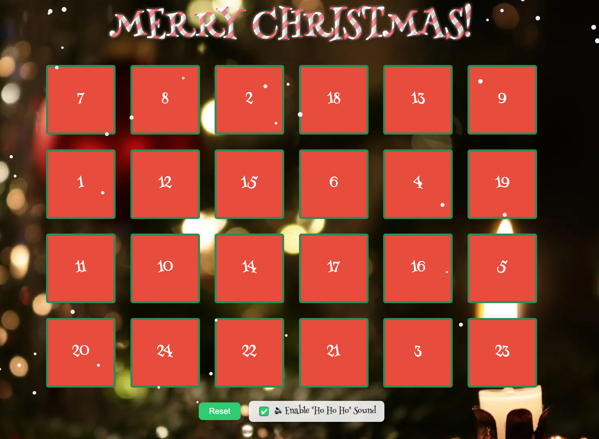

# 🎄 Advent Calendar 2025

> *A cozy, customizable digital advent calendar — perfect for any December, every year.*



Ho ho ho! Welcome to **Advent Calendar 2025**, a joyful little web project that lets you create your *own* online advent calendar.

Whether you’re surprising friends, delighting family, or spreading cheer in your classroom, this calendar unlocks a new surprise each day in December — images, videos, or messages — all with festive sparkle.

---

## ✨ Features

* **🎁 Daily surprises** — Each door unlocks a new image, message, or YouTube video.
* **🕰️ Date-gated magic** — Doors open only on or after their day (Dec 1–24).
* **🗃️ Memory included** — The calendar remembers opened doors until you reset it, with a friendly confirmation dialog so progress isn’t wiped by accident.
* **🧁 Customizable** — Swap in your own images, videos, or quotes — no coding skills required.
* **❄️ Falling snow** — Gentle snowflakes float across your screen (unless your device says “no thanks” to motion).
* **🔊 Ho Ho Ho toggle** — Optional Santa laugh when you open a door!
* **📱 Fully responsive** — Looks great on phones, tablets, and big desktop displays.
* **🧑‍🎄 Festive flair** — Candy-cane cursor, snow-capped doors, and Christmas coloring.

---

## 🛠️ Setup

1. **Download or clone this repository:**

   ```bash
   git clone https://github.com/HenniePenny/adventCalendar2025.git
   ```
2. **Open the project folder**, then double-click `index.html` to open it in your browser.
   That’s it! No installation, no build process — just pure, static HTML + CSS + JS joy.

3. *(Optional)* Host it on your favorite static site service such as **GitHub Pages**, **Netlify**, or **Vercel** to share with others.

---

## 🧪 Testing your calendar

While you’re building or customizing, you don’t have to wait until December 1 to peek behind the doors.

Inside script.js, near the top, you’ll find:

 ```js
// --- TEMPORARY: pretend today's date is Dec 10 for testing ---
today.setMonth(11);   // December (0-based)
today.setDate(12);
```

You can change the day number to preview any date.

To unlock every door instantly, set:
 ```js
const FORCE_TESTING_MODE = true;
```

When you’re ready to go live, simply comment those lines back out and reset:
 ```js
const FORCE_TESTING_MODE = false;
```

Now the calendar will open each door only on its proper December day. 🎁

---

## 🔐 How door locking works

The calendar automatically unlocks each door on its correct day in **any December** based on the visitor’s local date.  

No configuration is needed — as long as you’re viewing the calendar during December, each day opens at midnight and earlier days stay open.

Outside of December, the calendar automatically enters **testing mode**, which unlocks all doors so you can preview your content.

---

## 🎨 Make it your own

Everything you need lives inside the `script.js` file — look for the **`surprises`** array.

Each entry looks like this:

```js
{ 
  type: "image",
  src: "assets/surprises/my-photo.webp",
  alt: "A cozy mug of cocoa and cookies by the fire"
},
{ 
  type: "youtube",
  url: "https://youtu.be/dQw4w9WgXcQ",
  title: "A festive favorite" 
}
```

You can mix and match:

* `type: "image"` → use local images in your `assets/surprises` folder
* `type: "youtube"` → embed cheerful videos
* `type: "text"` → show short messages or quotes

💡 **Tip:** You don’t need to change the code logic — just replace the content inside the array.

### Easy mode ( no coding )

If you don’t want to edit JavaScript, simply replace the images in the `assets/surprises` folder using the same file names.

Your calendar will automatically show your new pictures.

---

## 🔔 Optional extras

* **Reset button:** Clears progress and reshuffles door order, with confirmation popup.
* **Sound toggle:** Turn the “Ho Ho Ho” effect on / off — the setting is remembered.
* **Snow effect:** Automatically adapts to screen size and disables itself if the user prefers reduced motion.

---

## ♿ Accessibility & compatibility

* Works on modern browsers — Chrome, Safari, Firefox, Edge.
* Respects “Reduce Motion” settings for accessibility.
* Supports both mouse and touch input.
* Keyboard navigation and focus outlines included.

🎄 **Ongoing improvements:**  
We’re actively working to expand accessibility support to ensure this calendar is usable and enjoyable for *everyone*. Our roadmap includes improved keyboard flow, stronger screen-reader support, and enhanced color-contrast options.

---

## 👩‍💻 Authors

**Created by:** [@HenniePenny](https://github.com/HenniePenny) & [@tlcoles](https://github.com/tlcoles)  
Built with care, curiosity, and a sprinkle of Christmas magic. 🎄

---

## 🎥 Acknowledgements

A sleighful of thanks to all the creators whose work adds sparkle to this project:

* **Public domain Christmas cartoons** featured via YouTube — including classics like
  *“Christmas Comes But Once a Year”* (1936, Fleischer Studios),
  *“Jack Frost”* (1934, Ub Iwerks),
  *“Snow Foolin’”* (1949, Famous Studios),
  *“The Pups’ Christmas”* (1936, Happy Harmonies), and more.
* **Festive imagery** adapted from freely available, royalty-free sources such as [Pixabay](https://pixabay.com/) and [Unsplash](https://unsplash.com/).
* **Fonts** from [Google Fonts](https://fonts.google.com/) — *Henny Penny*, the happiest font around.

And of course:

> 🪄 *Special thanks to all the coders whose work seeds the large language model behind ChatGPT (OpenAI). We used this resource for technical guidance, code wizardry, and creative collaboration throughout development.*

---

## 🧑‍💻 Contributing

Found a bug in Santa’s code? Got a bright idea for a new festive feature?
Fork the repo, make your tweaks, and send a pull request — the elves will thank you!

---

## 📜 License

**Made with ❤️, JavaScript, and a pinch of cinnamon.**
Free to use, share, and remix — just spread the joy and credit the original project.
Happy coding, and may your December always be merry! 🎅